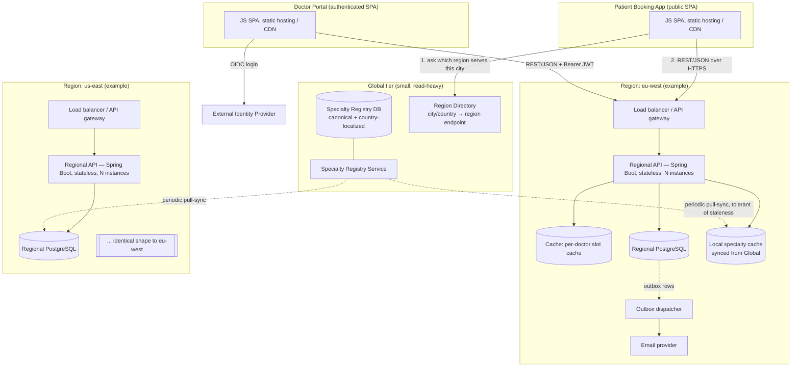
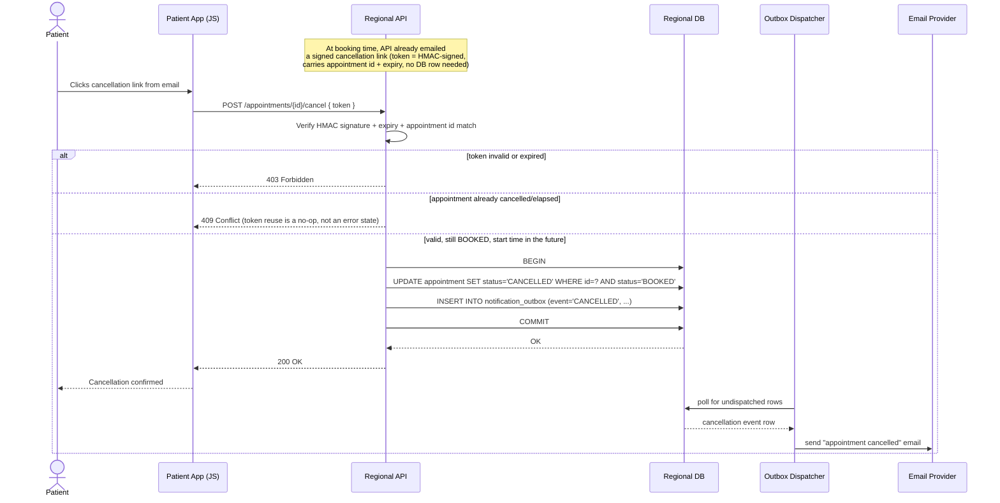

# 01 — Architecture

## 1. Shape of the system

The system is **N independent regional deployments** plus **one small global service**. There is no global request path for booking or search — a request is served entirely inside the region that owns the city it targets. The global service exists only for the one piece of state that genuinely has to be shared: the specialty registry (§4 of the brief; see `decisions/0003-global-specialty-registry.md`).



An external identity provider (OIDC) is shown attaching at the doctor portal's login and at the API gateway/edge of each region, where bearer tokens are validated. Anonymous patient traffic never reaches that path.

Each region is **operationally self-sufficient**: its database, cache, and notification pipeline live inside it, and it keeps a locally cached, possibly slightly stale, copy of the specialty registry. If the global tier is unreachable, existing regions keep serving search, booking, and cancellation without degradation — only *new-country onboarding writes* to the canonical registry are affected (see `decisions/0003-global-specialty-registry.md`). This is what makes the 24/7 requirement and "one region's failure degrades one geography, not the system" (§2) actually true, rather than aspirational.

## 2. Why region-partitioned at all, given the load figures don't require it

Stated plainly, because the brief requires it to be stated plainly: **~200 searches/sec against ~50,000 doctors and ~5,000,000 appointments/year is a load a single well-indexed PostgreSQL instance would handle without difficulty.** Partitioning is not a throughput decision here.

The actual drivers are:

- **Data residency.** An appointment record pairs an email address with a medical specialty — sensitive personal data under GDPR and equivalent regimes. Keeping a French patient's data inside an EU region, and never routing it through a US primary, is a materially easier compliance story than a single global database with row-level residency rules bolted on.
- **Failure isolation.** A regional outage should degrade one geography, not the whole system. That's a topology property, not a scaling property.
- **Latency.** Doctors and patients transact locally — search and booking traffic for a city should hit a nearby database, not round-trip across an ocean.
- **It's nearly free here.** Appointments are inherently local: a patient in Boston books a doctor in Boston. There are no cross-region transactions in this domain (§6), so partitioning doesn't introduce distributed transactions, two-phase commit, or cross-shard joins anywhere in the hot path. The only shared state is the specialty registry, and it's explicitly read-heavy and stale-tolerant — the one kind of state that's cheap to replicate loosely.

See `decisions/0001-region-partitioning.md` for the full ADR, including the alternative (single global database) and why it's rejected on residency/isolation grounds despite being sufficient on throughput grounds.

## 3. Layers within a region

Each regional API is a **modular monolith**, not a microservice mesh. At this scale (one region serves a fraction of 50,000 doctors), splitting into independently deployed services would add operational surface (service discovery, distributed tracing, network calls where a method call would do) without a scaling justification. Modules are separated logically so boundaries are clean if a future split is ever needed, not because it's needed now.

Internally, each module follows **ports-and-adapters (hexagonal)**:

```mermaid
flowchart LR
    subgraph API["API layer"]
        REST[REST controllers / DTOs / OpenAPI]
    end
    subgraph App["Application layer"]
        Svc[Use-case services:<br/>BookingService, SearchService,<br/>DoctorOnboardingService, CancellationService,<br/>RescheduleService, SuggestionService,<br/>MonthlyAgendaService]
    end
    subgraph Domain["Domain layer — framework-free"]
        Entities[Doctor, AvailabilityRule, Appointment,<br/>Slot (value object), CancellationToken]
    end
    subgraph Infra["Infrastructure layer"]
        JPA[Spring Data JPA repositories]
        OutboxW[Outbox writer]
        Sched[Scheduled jobs: retention purge,<br/>registry sync, outbox dispatch]
        Mail[Email client adapter]
    end
    REST --> Svc --> Entities
    Svc --> JPA
    Svc --> OutboxW
    JPA --> Domain
```

The domain layer (entities, the slot-derivation algorithm, the DST rules, the state machine) has no Spring or JPA annotations on it — it's tested as plain Java. This is what the class diagram in `03-domain-model.md` describes. Persistence mapping lives in the infrastructure layer as a separate concern.

## 4. Backend technology choices (§13)

**Java 21 (LTS), Spring Boot 3.x, PostgreSQL.**

- The team is Java-expert; Spring Boot is the path of least new-tooling-risk for them, with mature support for exactly the pieces this design needs: Spring Data JPA/JDBC, `@Scheduled` for the outbox dispatcher and retention purge job, Testcontainers for integration-testing the DST and concurrency logic against a real Postgres, and Micrometer for the metrics that the p99 target in §10 needs to be *observed*, not just designed for.
- Java 21 specifically for **`java.time`**, which is the whole DST design in `05-time-and-dst.md` — `ZonedDateTime`, `ZoneId`, and its own explicit, well-tested handling of gaps and overlaps that this design's DST policy is built on top of and constrains.
- Postgres is chosen over a NoSQL store because the domain is fundamentally relational (doctors, rules, appointments, uniqueness constraints) and because two Postgres features are load-bearing: **partial/composite unique indexes** (the booking constraint in §6) and **range types** (`tstzrange`), useful for availability-window and unavailability-window queries.
- An alternative considered was Quarkus, for faster cold starts — rejected because nothing in this design runs at a scale or in a deployment shape (serverless, high churn) where cold-start time matters, and it would cost the team unfamiliar-framework risk for no corresponding benefit.

## 5. Inter-tier protocol (§13) — justified against the JS-only frontend constraint

**REST over HTTPS, JSON payloads, described by an OpenAPI 3 spec.**

This is the direct answer to the constraint that frontend engineers must never need to write Java:

- **gRPC** would require a `.proto`-based code-generation step to produce JS clients (via grpc-web plus a proxy, since browsers can't speak HTTP/2 gRPC framing directly). That's an extra build-tool dependency the frontend team would own without it buying them anything — there's no browser-native gRPC support, and grpc-web's tooling story is a worse fit for a small team writing plain JavaScript than `fetch()` against JSON.
- **GraphQL** would require a schema/resolver layer on the backend (backend-owned complexity for a mostly-fixed, small set of endpoints — five original plus three identified gaps — that doesn't benefit from arbitrary client-shaped queries) and a client library on the frontend. It solves an over-fetching problem this API doesn't have.
- **REST/JSON** requires nothing beyond `fetch()` on the frontend and standard Spring MVC controllers on the backend. An OpenAPI spec is published alongside the API; frontend teams may optionally run a codegen step (e.g. `openapi-typescript`) to get typed clients, but this is opt-in tooling in their own language, not a requirement to touch Java.

No API gateway product is mandated by this design; a regional load balancer terminates TLS and routes to the stateless API instances. OIDC bearer-token validation happens as middleware in the doctor-portal request path (Spring Security resource-server support), not as a separate bespoke component.

## 6. Frontend technologies

Two separate SPAs, both plain JavaScript (a framework such as React is a reasonable default but not mandated by this brief), each statically hosted and served via CDN:

| | Patient booking app | Doctor portal |
|---|---|---|
| Auth | None — anonymous | OIDC (external IdP), Bearer JWT on every request |
| Reads | Free-slot search, by date/city/specialty | Own appointments, own profile |
| Writes | Book, cancel (via emailed token), participate in reschedule | Define availability, request suggestions, reschedule, cancel |
| Region routing | Resolves target region from city via Region Directory (§1) | Resolves region from doctor's registered city at login |

They are kept as two deployable artifacts rather than one app with a login screen because their trust boundaries and request shapes are different enough (anonymous vs. authenticated, different rate-limiting and CSRF postures) that bundling them would mean the anonymous app shipping authenticated-only code paths it never uses, and the authenticated app's security review having to reason about an anonymous surface bolted onto the same bundle.

## 7. Notification pipeline

Notifications (§10) are **out-of-band of the booking transaction**, using the **transactional outbox pattern**:

1. A booking, cancellation, or reschedule use-case, inside its single database transaction, writes both the domain state change (e.g. `appointment.status = BOOKED`) *and* a row into `notification_outbox` (event type, payload, `dispatched_at = NULL`).
2. That transaction commits. The HTTP response returns success to the caller. Email has not been sent yet, and its eventual failure cannot roll back the appointment.
3. A separate scheduled dispatcher (in-process `@Scheduled` job, polling `notification_outbox WHERE dispatched_at IS NULL ORDER BY created_at LIMIT N FOR UPDATE SKIP LOCKED`) picks up undispatched rows, calls the email provider, and marks them dispatched on success. On failure it retries with backoff, bounded by an attempt counter; rows that exceed it are flagged for operator attention rather than retried forever.

This gives **at-least-once delivery**: a crash between commit and dispatch simply leaves the row for the next poll; a crash between "email sent" and "marked dispatched" causes a duplicate email, which is an acceptable trade for a medical appointment reminder (never losing one is worth occasionally duplicating one). See `decisions/0004-transactional-outbox.md` for why polling was chosen over a message broker or CDC pipeline (Debezium/Kafka) at this scale.

**Why it cannot be synchronous with booking:** if sending email were part of the booking transaction (or a synchronous call after it that the caller waits on), an SMTP timeout or provider outage would either roll back a perfectly valid appointment (unacceptable — the slot was legitimately claimed) or leave the caller blocked on a concern that has nothing to do with whether the booking succeeded. Decoupling means booking latency is bounded by the database, and email delivery — outside this system's control — can be slow, retried, or briefly down without touching booking correctness.

## 8. Where this leaves the endpoints

The five original endpoints plus the three identified gaps (doctor onboarding, rescheduling, doctor-initiated cancellation) are all regional REST endpoints under the module boundaries in §3. Endpoint contracts, request/response shapes, and the search pagination/grouping rules (§9 of the brief) are detailed in `02-data-model.md` (where they map directly to indexes) and `04-suggestion-algorithm.md` (for the suggestion endpoint specifically).

## 9. Sequence diagram — token-authorized patient cancellation (§5, §15)

This is the flow that makes "patients have no accounts" survivable: possession of a signed, expiring, single-purpose token is the entire authorization model.



No token table is required: the token is self-verifying (signature + embedded expiry + embedded appointment id), and reuse after a successful cancellation is naturally rejected because the `WHERE status='BOOKED'` guard no longer matches — the same database-level guard that makes booking race-free (§10 in `02-data-model.md`) makes token replay harmless for free.
