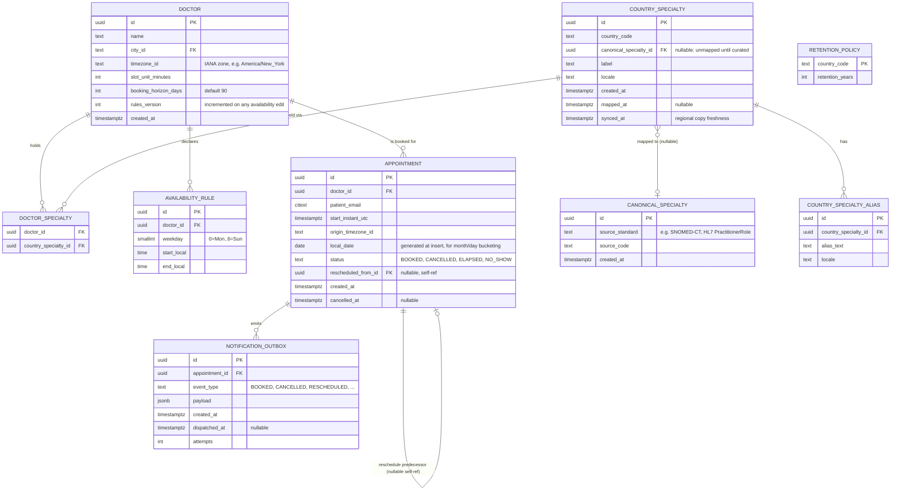
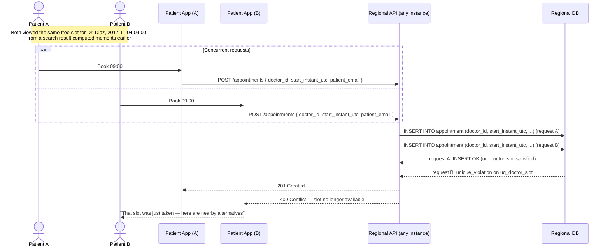

# 02 — Data Model

All tables below live in the **regional** PostgreSQL database except `canonical_specialty`, which lives in the **global** registry database; `country_specialty` and `country_specialty_alias` are *owned* by the global tier but a synced, read-only copy of them is cached inside each region (see §4 and `decisions/0003-global-specialty-registry.md`). The ER diagram shows the regional copy, which is what the regional API actually queries.

## 1. Entity-relationship diagram



## 2. Table notes

### `doctor`
`timezone_id` and `slot_unit_minutes` are exactly the two facts §3 requires availability to be interpreted against — wall-clock plus IANA zone, never a UTC offset. `rules_version` exists purely for cache invalidation (§10): every edit to `availability_rule` or to `slot_unit_minutes`/`timezone_id` increments it, and the per-doctor slot cache is keyed on `(doctor_id, rules_version)` so a stale cache entry is simply never looked up again rather than needing active invalidation.

### `availability_rule`
One row per (weekday, contiguous window) — a doctor working "Mon–Fri 08:00–14:00 and 16:00–18:00" is four rows for Monday through Friday, each split into two windows, i.e. `5 × 2 = 10` rows. No timezone column here: it's inherited from the parent `doctor` row, because a single doctor operates in one timezone (her clinic's). Deliberately no `valid_from`/`valid_to` — the brief is explicit that availability changes apply going forward and never retroactively void bookings (§7), so there is exactly one *current* rule set, not a history of them; if a doctor changes her hours, the old rows are replaced, `rules_version` increments, and already-booked appointments are untouched because appointments never reference availability rows at all (see below).

### `appointment` — the constraint that makes booking race-free
```sql
ALTER TABLE appointment
  ADD CONSTRAINT uq_doctor_slot UNIQUE (doctor_id, start_instant_utc);
```
This single index *is* the concurrency control for §6 — see §4 below for the full argument and the sequence diagram.

`appointment` never has a foreign key to `availability_rule` or to any slot concept — per §7, a slot is a derived view, not a persisted entity, so there is nothing for an appointment to reference. This is also *why* §7's "availability changes never void existing appointments" is automatic rather than a rule that has to be actively enforced: an appointment's validity was never expressed in terms of the current rules in the first place. The system separately *detects* appointments that now fall outside declared availability, for the doctor's benefit, via a read-time comparison (an appointment's `start_instant_utc`/`origin_timezone_id`, converted to local wall-clock, checked against current `availability_rule` rows) rather than any stored flag — because a stored "now conflicting" flag would need to be kept in sync with every future rule edit, and a computed check does not.

`local_date` is a generated column (`GENERATED ALWAYS AS (...) STORED`, computed from `start_instant_utc` converted into `origin_timezone_id` at write time) so that "list my appointments for November 2017" — which must resolve month boundaries in the clinic's timezone (§3) — is a plain indexed range scan instead of a per-row timezone conversion at query time.

`status` is the lifecycle state from `03-domain-model.md` §2 (`BOOKED`, `CANCELLED`, `ELAPSED`, `NO_SHOW`), kept as four distinct values rather than collapsed, per the explicit instruction in §8 of the brief.

`rescheduled_from_id` supports rescheduling as an atomic cancel-and-rebook (§9 of the brief, "Identified gaps" #7): the old appointment row is marked `CANCELLED`, a new row is inserted pointing back at it, both in one transaction. This preserves history (useful for the patient-facing "why did my appointment move" story and for future patient management, §11) instead of mutating the original row's time in place.

No `cancellation_token` table exists. As explained in `01-architecture.md` §9, the token is self-verifying (HMAC signature + embedded expiry + embedded appointment id) and needs no server-side state; the `WHERE status = 'BOOKED'` guard on the cancellation `UPDATE` makes replay of an already-used token a harmless no-op rather than a double-cancellation.

### Specialty tables
`country_specialty.canonical_specialty_id` is nullable specifically to represent the "locally valid but unmapped" state from §4: a country onboarding a specialty writes this row immediately with `canonical_specialty_id = NULL`, and it is immediately usable in `doctor_specialty` and in search — curation later sets the FK, and nothing that already referenced the row needs to change. `synced_at` records when the regional copy last pulled from the global registry, making staleness visible rather than silent.

### `retention_policy`
Keyed by `country_code`, not a single global constant, because retention periods for medical records are legally mandated and vary by jurisdiction (§10) — a region that serves multiple countries needs one row per country it covers, not one per region.

## 3. Indexes and why (the p99 < 300ms requirement)

The brief fixes computed-on-read slot derivation (§7) and then sets a p99 < 300ms target for a **page of 20 doctors** (§10). Two facts make this achievable:

1. **Search cost scales with the page (20 doctors), not with the city.** Doctors are paginated, never slots (§9 of the brief) — so a single search request only ever needs to compute slots for 20 doctors' availability rules minus their existing appointments, not for every doctor in the city.
2. Given that bound, the remaining cost per request is: (a) find the next 20 doctors matching city + specialty, (b) for each, fetch their availability rules and existing appointments in the requested window, (c) compute free slots in memory.

Indexes supporting each step:

```sql
-- (a) Doctor discovery, denormalized for the hot search path.
-- Avoids a join through doctor_specialty on every search request.
CREATE TABLE doctor_city_specialty (
  doctor_id uuid REFERENCES doctor(id),
  city_id text NOT NULL,
  country_specialty_id uuid NOT NULL,
  PRIMARY KEY (doctor_id, country_specialty_id)
);
CREATE INDEX idx_search
  ON doctor_city_specialty (city_id, country_specialty_id, doctor_id);
-- kept in sync at write time whenever doctor.city_id or doctor_specialty changes —
-- an admin-rate operation, not a search-rate one, so the extra write cost is negligible.

-- (b) Existing appointments for the candidate doctors, in the requested date's window,
-- needed to subtract booked slots from computed availability.
CREATE UNIQUE INDEX uq_doctor_slot
  ON appointment (doctor_id, start_instant_utc);   -- also the §6 concurrency constraint
CREATE INDEX idx_doctor_local_date
  ON appointment (doctor_id, local_date, status);   -- month/day bucketing, clinic-tz resolved

-- (c) Availability rules, small per doctor (a handful of rows), fetched by doctor_id.
CREATE INDEX idx_availability_doctor
  ON availability_rule (doctor_id);
```

`idx_search` turns "20 doctors in Boston who are traumatologists, page 3" into a single index range scan with the pagination cursor as a bound (`doctor_id > last_seen_id LIMIT 20`) — no scan of the whole city.

`idx_doctor_local_date` is what makes "doctor's appointments for a given month" (§9's endpoint 5) and "which of this doctor's slots on 2017-11-04 are already taken" (needed inside every search and suggestion computation) both indexed range scans instead of table scans, without doing timezone math inside the query.

### Caching layer, on top of the indexes
Per-doctor slot computation for a given date range is deterministic given `(availability_rule rows, appointment rows in range, rules_version)`. A shared regional cache (Redis, so it's consistent across the horizontally-scaled stateless API instances rather than duplicated per-instance) stores computed slot lists keyed on `(doctor_id, rules_version, date_or_month)`, with a short TTL as a backstop and explicit invalidation (by bumping `rules_version`, or by a targeted delete on new bookings for that doctor/date) as the primary mechanism. Because bookings and availability edits are comparatively rare next to searches (the brief states the system is strongly read-heavy), the cache hit rate on the search-heavy path is expected to be high, keeping the p99 dominated by cache/index lookups rather than by recomputation. See `decisions/0002-computed-on-read-slots.md` for the full reasoning and the rejected alternative (a materialized slot table).

## 4. Sequence diagram — concurrent booking of the same slot (§6, §15)



The two `INSERT`s can land on different API instances (the regional API is stateless and horizontally scaled) and even arrive at the database in either order — it doesn't matter which. The database's `UNIQUE (doctor_id, start_instant_utc)` constraint is the single source of truth for "who got it," which is exactly what §6 requires: enforcement by a database uniqueness constraint, not by an application-level check-then-insert that would have a race window between the check and the insert. Because doctor and appointment always live in the same regional shard (§2 of the brief), this is a single-row, single-shard write with no distributed coordination — the reason the brief calls this "nearly free."

Losing request gets a normal `409`, not a retry loop or a lock wait — the application layer doesn't pre-check availability and then insert; it always attempts the insert directly and treats a unique-constraint violation as the *expected* signal that it lost the race, which is what a constraint-based approach buys over a read-then-write approach.
