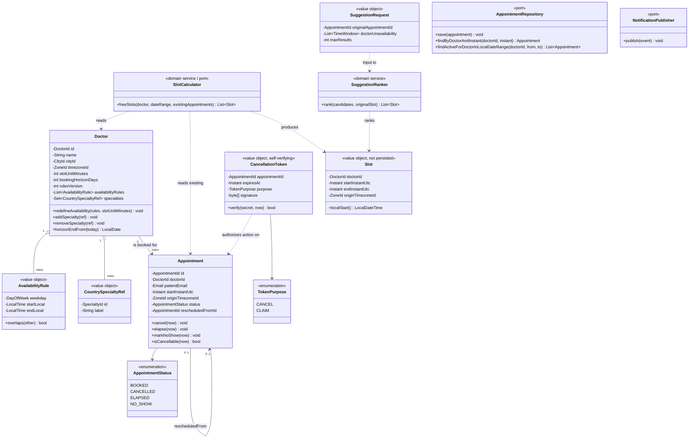
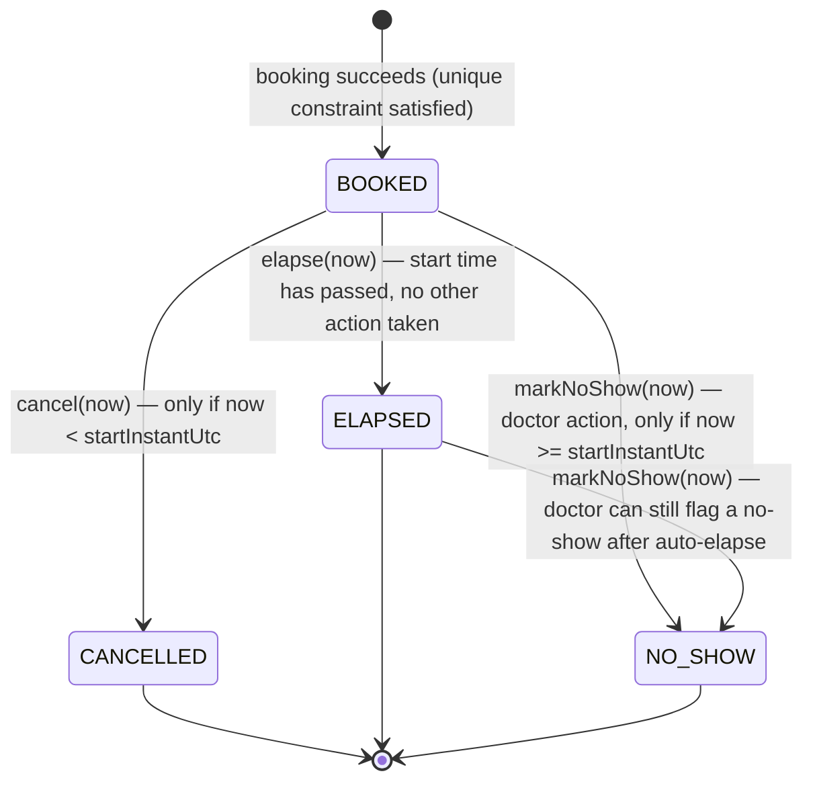

# 03 — Domain Model

This describes the **domain layer** from `01-architecture.md` §3 — framework-free classes and the state machine they enforce. Persistence mapping (JPA entities, repositories) is a separate, deliberately thinner layer in the infrastructure tier and isn't shown here; a domain class is not a database row.

## 1. Class diagram

Notes on a few choices:

- **`Slot` is a value object, never persisted** — it exists only as the output of `SlotCalculator`, consistent with §7 ("a slot is a derived view, not an entity"). It carries `originTimezoneId` because a slot about to be booked needs to become an `Appointment`, which requires that same field.
- **`SlotCalculator` and `AppointmentRepository` are ports** (interfaces) in the domain layer; their implementations (the cached, index-backed Postgres query described in `02-data-model.md`) live in infrastructure. This is what lets the DST and displacement-ranking logic be unit-tested without a database.
- **`CancellationToken` carries a `TokenPurpose`.** Today only `CANCEL` is issued; `06-future-patient-mgmt.md` reuses the same class with `CLAIM` rather than inventing a parallel token mechanism — the purpose field exists now specifically so that reuse doesn't require a breaking change later.
- **`Appointment.rescheduledFromId`** is how rescheduling shows up in the domain model: a self-referential, optional link from the new appointment to the one it replaced. Rescheduling is not a state on `AppointmentStatus` — it's realized as "old appointment transitions to `CANCELLED`, new appointment is created `BOOKED` with this link set," both inside one application-layer transaction (`RescheduleService`, not shown — it's an orchestrator over `Appointment.cancel()` + `Appointment` construction, not a class with its own domain state).

## 2. Appointment lifecycle — state machine (§8)

Four distinct terminal-or-transitional states, kept separate deliberately (per the brief's explicit instruction not to collapse them):

- **`BOOKED`** — the only state in which cancellation is possible, and the only non-terminal state.
- **`CANCELLED`** — patient- or doctor-initiated, and `Appointment.cancel(now)` enforces the "before start only, rejected after" rule (§8) directly in the domain object, not just at the API layer, so it can't be bypassed by any other call path into the domain.
- **`ELAPSED`** — the default outcome of time simply passing with no cancellation and no explicit no-show flag. This transition is applied by a lightweight scheduled sweeper (alongside the outbox dispatcher and specialty-registry sync jobs already described in `01-architecture.md` §7), not by the request path — nothing about booking or search needs to know an appointment just elapsed. Because the transition is lazy, the cancellation guard (`now < startInstantUtc`) is checked independently at cancel time rather than relying on status having already been flipped to `ELAPSED` — correctness doesn't depend on the sweeper's polling interval.
- **`NO_SHOW`** — an explicit doctor action, available once the start time has passed, whether or not the sweeper has already promoted the row to `ELAPSED`. It is not a system-inferred state (the system cannot know a patient didn't show up; only the doctor can report it).

"Active appointments" for the monthly-listing endpoint (§9, endpoint 5) means **any status other than `CANCELLED`** — `BOOKED`, `ELAPSED`, and `NO_SHOW` all represent appointments that genuinely occupied the doctor's calendar and are meaningful history; `CANCELLED` ones are the only ones excluded, because a cancelled slot never happened from the doctor's-agenda point of view.
